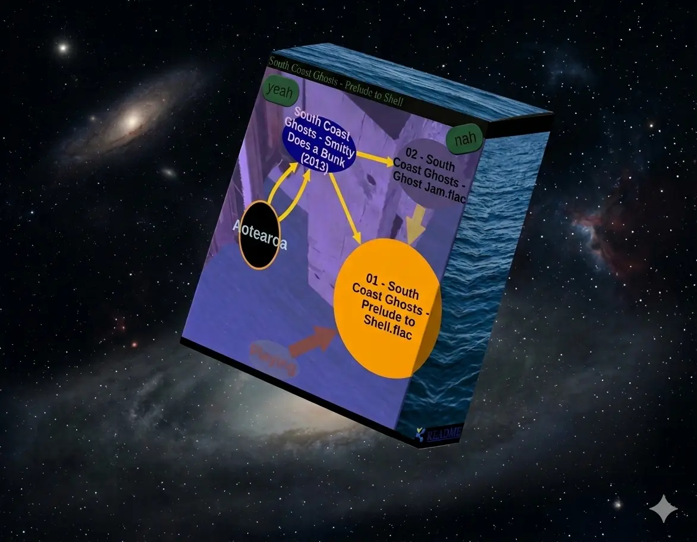

# jamsend

modern music piracy in the browser

# features



## safety

Could be better but is fantastic.

## p2p

Music comes from connections you make - manipulation is impossible.

## experience

You listen to someone's music collection, always jumping into the middle of a random track, like tuning a radio. Normal everyday options spring up.

## downloads

Preserve directory structure, tend to move whole albums, restart if interrupted.

# funding

Help! [Cash will be applied](https://ko-fi.com/ostylehouse). Long story. Wanting to create high quality work to nice things up. I've wanted to build but needed the more complete metaphysics that now seems to be here to make it all connect. Wanting to feed it brains. It's becoming a competent system for managing change, including of itself. Important!

# development

Help also! Get this to your programmers! Make noise as Issues on github, especially grandiose new feature requests that introduce your creative mind.

This effectively locates the frontier of computer interface and program design. This is a relatively tidy part of an ongoing project to capture the core of the universe with language, which I've been working on for a long time, and fix the computer once and for all. It now appears in the guise of a music piracy app, to communicate.

Plans soon include a compiler of a nice language that we could do CodeMirror integration with and so provide a REPL. Then a lot of eg ghosts/ can be rewritten to look quite saleable, and it'll all seem a new language is being born, inspire everyone and attract funding easier.

Plans later are that this general technology should grow into the best place for any information, and be standard.

# hiring

Proudly supporting the $3/hr programmer, which means under 16 in NZ. You may of course volunteer on open source software. Go for it. All development, commissioning and correspondence is on github under the eyes of the law. There are vaguely 20 40hr developments I expect 70% success with the first week!

You would need to get it set up yourself but reach out if anything isn't easy. If you can change code with reliable results, yay.

There are many non-frontend things to do. See Issues, or comments starting with < in the code, which means less-than-existant ie TODO.

## notes

DevTools with 'pause on exception' will need to ignore the line in Decoder.ts with a meaningless RangeError, etc, it sometimes adds random breakpoints, which can be ignored or switched off in the expandy-rack to the right, between Watch and Scope.

To use *prod.sh*, see *Peer_OPTIONS*, but we no longer use socket.io which it may be unadapted for.

## objects, data layer

Here is a tour of the p2p layer, then some primitive almost-data-layer objects like *Thing* that are quite pragmatic and irrelevant, then, really,  *TheC*. To start reading the code, try [data/Stuff](src/lib/data/Stuff.svelte.ts).

To write code, the src/lib/ghost/\*.svelte is the best place to build things because it'll update the Modus live without restarting anything, but they need to be included by a Modus, which are included by some kind of *\*Feature*, so do a whole lot of searches and readings, you probably want to add another %w=yourmethod to some M.do_A().

### Peerily...

Is the main|single object doing p2p. It persists to localStorage info mentioned in this section. It has one or more *Peering* listen addresses (which are public keys) which collect *Pier* remote counterparts when people scan QR codes or so.

*Pier* can give each other trust (see *TrustName*), which might also come from QR codes or so. Trust enables a *PierFeature* (*PierSharing*) at both ends, which shows UI parts of the feature relevant to the individual *Pier*, and also a *PeeringFeature* on *Peering*, for the main, for-itself UI of the feature as a whole, eg *PeeringSharing*.

### Things

Are persisted to IndexedDB. They CRUD, start|stop, and integrate with the *Things*/*Thing* UI generics which have specifics imposed by their client, eg *Shares*.

Eg *PeeringSharing* has a *DirectoryShares* object that can be given to the *Things* UI, which takes care of getting each *Thing* happening, including autovivifying the first one. It's important that this list of things uses IndexedDB because that's how to persist the *FileSystemDirectoryHandle* permission we acquire across page reloads.

### Stuff

*TheC* is a piece (C) of the computer's mind, and is posited as the standard linguistic item you should believe in. It is the set of properties on the thing (philosophically, not the *Thing* mentioned above). There's an upper (C.sc) and lower (C.c) hemisphere, supposing the user is up and the machine is down. C.c is for esoteric hacks for very nearby machinery, C.sc is for everything you'd ever want to see easily.

*TheC* extends *Stuff*, which allows them to contain each other (eg C/C, C/C/C, etc), and thus insert (C.i({props:1})) and select (.o({props:1})) them. Sets of them get replaced ongoingly, which usually resolves which is which and resumes|re-attaches their /*, eg C/C/C that C/C had before it was re-inserted empty.

We can note (in comments and spec (so far)) the name of a C variable, and some relevant structure and properties like so:

``D%nib=dir`` is probably in a tree of D**, its .sc.nib='dir'

``%record/*%preview`` is the many %preview inside a %record

*Stuffing* puts them on the screen efficiently, grouping like stuff, compressing communication.

*Travel* does recursion into trees of C (aka C**, eg C/C, C/C/C, etc).

*Selection* is *Travel* with change tracking and enough thinking to be useful for eg *Directory* and *Cytoscaping*, it should be a fairly universal type of stuff-going-on. We usually simply put something somewhere then come back later and look for something like it, this is an attempt to formalise that being, lifecycling part of reality.

*Modus* is an agenda to attend to, has a heartbeat, provides persistent memory via *Modusmem*... Eg *DirectoryModus* wanders around your *DirectoryShare* looking for music to make available, and traces of our mind we may have stored in there.

And now all further introduced *Objects* here are not javascript classes of their own, but are *TheC* that define themselves with their C.sc.*, eg A:such is C%A=such .

*Modus* (aka *M*), or some subclass of it, contains many *A*/*w* that organise to do the work. They can handle events via %elvis=sometype,Aw=suchAplace/workertype .

About here is the frontier, but probably:

And now these are the important user-mind things to persist in *Modusmem* and beyond:

*View* shall look into *M/A/w\*\** and process it via *Stuffing* and *Selection* into *Cytoscape* and other UI-things... Probably solving the difficulty connecting the *Stuffing* etc UI interaction <-> the process flowing into it.

*Heist* does the sequential work of replicating a *Selection* somewhere. It should work on either end.

*Info* know about *Heist*s, and whatever the user jots down about anything. Inform layout. Remain.

### Ultimately

- machine should be more feminine and competent
- C and everything in Stuff.svelte.ts
- Stuff.replace() and Stuff.resolve() (aka re-identity) are important to adapt to and study academically, for a design pattern more suited to [merge](https://en.wikipedia.org/wiki/Merge_(linguistics))
- Selection.process() as a care factory for intersecting realities

## goals

- hiring $3/hr programmers
- get funding
- shared directories
- climbing directories, properly randomly selecting, transcoding in ffmpeg-wasm
- guess the `Artist/1979 Album/01 Track.etc` hierarchy, general noise sorter and goo tuner
- read a big music library via some API, eg readonly open your Strawberry music player's sqlite database, to be able to search up tracks
- streaming, show gear. voice calls?
- safer content filter. assure media-contained album art is legit.
- collectivise music collection connections, ie multi-hop
- build a trust network, advanced social network features aka SafetyNet
- cytoscape ui, presence|rate|pitch-bendable aud
- culture (ethnology, typology, ?) graph
- auto-heal corrupt data
- utopian stuff, conservation schemes for local disk space alleviation

# setup

```bash
# get such a container
docker compose build
# populate your ./node_modules, mounted in the container under /app
docker run --rm -v .:/app jamsend-app:latest npm install
# thence
docker compose up
# maybe eventually
cd ..; git clone jamsend prod-jamsend; cd prod-jamsend; ./prod.sh
```

If your docker0 interface isnt 172.17.0.1 (so eg _leproxy_ can reverse to it), edit *docker-compose.yml* and related things until it works. You should then look at `docker compose ps` to see where it's listening, it may need to be on localhost. Getting it on the interweb is left a bit hard, just help this project until we make an app scripting language and the community can develop what you need.

## Licensing

This project is licensed under the terms of the **GNU Affero General Public License v3.0 or later**. The full text of the license can be found in the [LICENSE](LICENSE) file.

Also you must release everything you build with it that is useful, eg makes money, entirely enough to be as useful as it is for you, with luscious writes about how it all is. Don't hold back! You're about to die!

Copyright (c) 2025 github.com/stylehouse